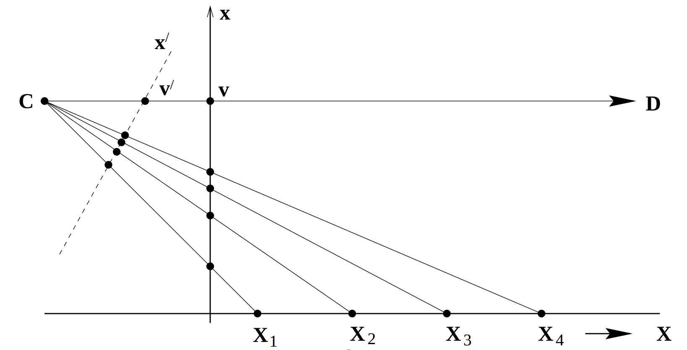
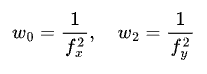
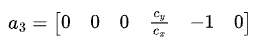
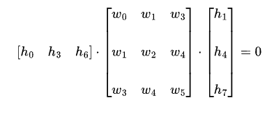
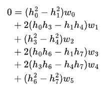

# Camera calibration

We provide a method `calculate_focal_length_from_homography` that estimates the focal length of a camera given the homography matrix and image size.

## Image of the absolute conic

We rely on the image of the absolute conic $\omega$, which is a symmetric matrix that can be written as:

$$
\begin{equation}
\omega = \begin{bmatrix}
w_0 & w_1 & w_3 \\\\
w_1 & w_2 & w_4 \\\\
w_3 & w_4 & w_5
\end{bmatrix}
\end{equation}
$$

It is related to the camera intrinsic matrix $K$ by the equation:

$$
\begin{equation}
\omega = K^{-T}\cdot K^{-1}
\end{equation}
$$

so once we obtain $\omega$, we can compute the camera intrinsic matrix $K$ from the Cholesky decomposition.

There are several constraints that can be imposed on it:

| Condition | Constraint |
| --- | --- |
| Vanishing points $v1$ and $v2$ from perpendicular rays| $v_1^T\cdot \omega \cdot v_2 = 0$ |
| Vanishing lines $l1$ and $l2$ from perpendicular planes | $l_1^T\cdot \omega^{-1} \cdot l_2 = 0$ |
| Vanishing point $v$ and  $l$ from perpendicular line and plane | $l=\omega \times v$ |
| Plane imaged with known homography $H = [\mathbf{h_1}, \mathbf{h_2}, \mathbf{h_3}]$ | $\mathbf{h_1}^T\cdot \omega \cdot \mathbf{h_1} = \mathbf{h_2}^T\cdot \omega \cdot \mathbf{h_2}$   $\mathbf{h_1}^T\cdot \omega \cdot \mathbf{h_2} = 0$ |
| No skew | $\omega_{12} = \omega_{21} = 0$ |
| Unit aspect ratio | $\omega_{11} = \omega_{22}$ |

Since $\omega$ is a symmetric matrix, we have 6 unknowns to find. The process of calibrating the camera would look something like:
1. Parametrize $\omega$ as a vector $w=[w_0, w_1, w_2, w_3, w_4, w_5]^T$
2. Find $n$ constraints from the relationships above and write them in the form $a_i^T\cdot w = 0$.
3. Stack the constraints in a matrix $A$ to form a linear system of equations $Aw=0$.
4. Solve the system using the SVD decomposition to find the null space of $A$.
5. Decompose $\omega$ into $K$ using the Cholesky decomposition.
6. Normalize $K$ so its last element is 1, i.e., $K[2,2] = 1$.

## Vanishing points

We have seen that some conditions rely on vanishing points. Let us quick see how they are computed.

Any 3D point in the line driven by direction $d=[d_x,d_y,d_z]$ passing through point $A$ in homogeneous coordinates $A=[A_x, A_y, A_z, 1]$ can be parametrized as:

$$
\begin{equation}
X(\lambda) = A + \lambda D
\end{equation}
$$

where $\lambda$ is a scalar and $D = [d_x, d_y, d_z, 0]$ is the direction vector in homogeneous coordinates.

We can project it to the image plane using the homography matrix $H = K \cdot [R | T]$, where $K$ is the intrinsic matrix, $R$ is the rotation matrix, and $T$ is the translation vector. The projection of the point $X(\lambda)$ in the image plane is given by:

$$
\begin{equation}
\begin{split}
x(\lambda) & = H \cdot X(\lambda) \\\\
&= H\cdot (A + \lambda D) \\\\
&= H A + \lambda K \left[ R | T\right ] \cdot \begin{bmatrix} d \\\\ 0 \end{bmatrix} \\\\
&= a + \lambda KRd
\end{split}
\end{equation}
$$

The vanishing point $v$ is given in the limit $\lambda \rightarrow \infty$, so we can write:

$$
\begin{equation}
v = \lim_{\lambda \rightarrow \infty} x(\lambda) = a + \lambda KRd = KRd
\end{equation}
$$

where $\lambda$ disappears since the projection is defined up to scale. Notice how the vanishing point only depends on the direction of the line $d$ and not on the point $A$, proving that all parallel share the same vanishing point. This is illustrated below:

<figure class="figure" style="text-align: center;">
  
  <figcaption class="caption" style="font-weight: normal; max-width: 80%; margin: auto;">The points Xi in line X are equally spaced in the 3D Euclidean space, but their projections distance in the image plane decreases as they move away from the camera center. We can trace a parallel line D to X passing through the camera center C, which would intersect with X at the infinity plane. The vanishing point v' is the projection of this intersection in the image plane, and is given by the intersection between the line $D$ and the image plane.</figcaption>
</figure>

## Derivation

In our case, we will assume our intrinsic matrix $K$ is of the form:

$$
\begin{equation}
K = \begin{bmatrix}
f_x & 0 & c_x \\\\
0 & f_y & c_y \\\\
0 & 0 & 1
\end{bmatrix}
\end{equation}
$$

where we have assumed no skew $s=0$. Its inverse is:

$$
\begin{equation}
K^{-1} = \begin{bmatrix}
\frac{1}{f_x} & 0 & -\frac{c_x}{f_x} \\\\
0 & \frac{1}{f_y} & -\frac{c_y}{f_y} \\\\
0 & 0 & 1
\end{bmatrix}
\end{equation}
$$

This results in the image of the absolute conic $\omega$ being:

$$
\begin{equation}
\omega = K^{-T}\cdot K^{-1} = \begin{bmatrix}
\frac{1}{f_x^2} & 0 & -\frac{c_x}{f_x^2} \\\\
0 & \frac{1}{f_y^2} & -\frac{c_y}{f_y^2} \\\\
-\frac{c_x}{f_x^2} & -\frac{c_y}{f_y^2} & \frac{c_x^2}{f_x^2} + \frac{c_y^2}{f_y^2} + 1
\end{bmatrix}
\end{equation}
$$

The conditions we impose are:

### No skew

From our previous table, we have the condition $w_1 = 0$, so our first row in A will be:

$$
\begin{equation}
a_1 = \begin{bmatrix}
0 & 1 & 0 & 0 & 0 & 0 \\
\end{bmatrix}
\end{equation}
$$

### Unit aspect ratio
We have the condition $w_0 = w_2$, so our second row in A will be:

  

Notice from Eq.(8) that

  

so we are effectively imposing $f_x = f_y = f$, which is the unit aspect ratio condition.

<!-- $$
\begin{equation}
a_2 = \begin{bmatrix}
1 & 0 & -1 & 0 & 0 & 0 \\
\end{bmatrix}
\end{equation}
$$ -->

### Principal point at the center of the image

If we pay attention to $w_3$ and $w_4$, we can see that they are related to the
principal point $(c_x, c_y)$ of the camera.

$$
\begin{equation}
w_3 = -\frac{c_x}{f^2}, \quad w_4 = -\frac{c_y}{f^2}
\end{equation}
$$

If the principal point is known, i.e., at the center of the image, we can impose

$$
\begin{equation}
\frac{c_y}{c_x} w_3 - w_4 = 0
\end{equation}
$$

which leads to the third row in A:

  

<!-- $$
\begin{equation}
a_3 = \begin{bmatrix}
0 & 0 & 0 & \frac{c_y}{c_x} & -1 & 0
\end{bmatrix}
\end{equation}
$$ -->

### Vanishing points for horizontal and vertical lines

We saw earlier we can get the vanishing point for a set of parallel lines with 3D direction $d = [d_x, d_y, d_z]$ as $v = KRd$. The matrix KR corresponds to the first 3 columns of the homography matrix $H$, so we can write:

$$
\begin{equation}
H = \begin{bmatrix}
h_0 & h_1 & h_2 \\\\
h_3 & h_4 & h_5 \\\\
h_6 & h_7 & h_8
\end{bmatrix}
\end{equation}
$$

So we can get two sets of orthogonal lines:

1. Horizontal:
   - $d_1 = [1, 0, 0]$
   - $v_1 = [h_0, h_3, h_6]$
2. Vertical:
   - $d_2 = [0, 1, 0]$
   - $v_2 = [h_1, h_4, h_7]$

Now let us apply the condition for vanishing points from perpendicular rays:

$$
\begin{equation}
v_1^T \cdot \omega \cdot v_2 = 0
\end{equation}
$$

Substituting the values of $v_1$ and $v_2$ we get:

  

<!-- $$
\begin{equation}
\begin{bmatrix}
h_0 & h_3 & h_6
\end{bmatrix} \cdot \begin{bmatrix}
w_0 & w_1 & w_3 \\\\
w_1 & w_2 & w_4 \\\\
w_3 & w_4 & w_5
\end{bmatrix} \cdot \begin{bmatrix}
h_1 \\\\ h_4 \\\\ h_7
\end{bmatrix} = 0
\end{equation}
$$ -->

which reduces to:

$$
\begin{equation}
\begin{split}
0 & = h_0 h_1 w_0 \\
& + (h_3 h_1 + h_0 h_4) w_1 \\
& + h_3 h_4 w_2 \\
& + (h_6 h_1 + h_0 h_7) w_3 \\
& + (h_6 h_4 + h_3 h_7) w_4 \\
& + h_6 h_7 w_5
\end{split}
\end{equation}
$$

This gives us the fourth row in A:

$$
a_4 = [h_0 h_1,\ h_3 h_1 + h_0 h_4,\ h_3 h_4,\ h_6 h_1 + h_0 h_7,\ h_6 h_4 + h_3 h_7,\ h_6 h_7 \,]
$$

### Vanishing point for 45º/135º lines

It would not be rare to observe that some set of parallel lines remain parallel after projection. Given our camera angles, this can happen for horizontal lines. So to make the system more robust, we can add the condition for vanishing points from perpendicular rays for 45º and 135º lines.

1. 45º lines:
   - $d_3 = [1, 1, 0]$
   - $v_3 = [h_0 + h_1, h_3 + h_4, h_6 + h_7]$
2. 135º lines:
   - $d_4 = [1, -1, 0]$
   - $v_4 = [h_0 - h_1, h_3 - h_4, h_6 - h_7]$

Replacing on the condition for vanishing points from perpendicular rays, we get:

  

<!-- $$
\begin{equation}
\begin{bmatrix}
h_0 + h_1 & h_3 + h_4 & h_6 + h_7
\end{bmatrix} \cdot \begin{bmatrix}
w_0 & w_1 & w_3 \\\\
w_1 & +w_2 & w_4 \\\\
w_3 & w_4 & w_5
\end{bmatrix} \cdot \begin{bmatrix}
h_0 - h_1 \\\\ h_3 - h_4 \\\\ h_6 - h_7
\end{bmatrix} = 0
\end{equation}
$$ -->

which reduces to:

  

<!-- $$
\begin{equation}
\begin{split}
0 & = (h_0^2 -h_1^2) w_0 \\
& + 2 (h_0 h_3 - h_1 h_4) w_1 \\
& + (h_3^2 - h_4^2) w_2 \\
& + 2 (h_0 h_6 - h_1 h_7) w_3 \\
& + 2 (h_3 h_6 - h_4 h_7) w_4 \\
& + (h_6^2 - h_7^2) w_5
\end{split}
\end{equation}
$$ -->

This gives us the fifth row in A:

  

<!-- $$
a_5 = [
    h_0^2 - h_1^2,\
    2 (h_0 h_3 - h_1 h_4),\
    h_3^2 - h_4^2,\
    2 (h_0 h_6 - h_1 h_7),\
    2 (h_3 h_6 - h_4 h_7),\
    h_6^2 - h_7^2
]
$$ -->

## References
1. Richard Hartley and Andrew Zisserman (2000), *Multiple View Geometry in Computer Vision*, Cambridge University Press.
